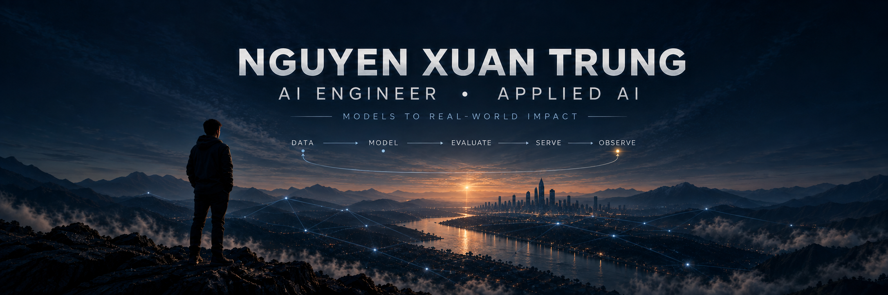
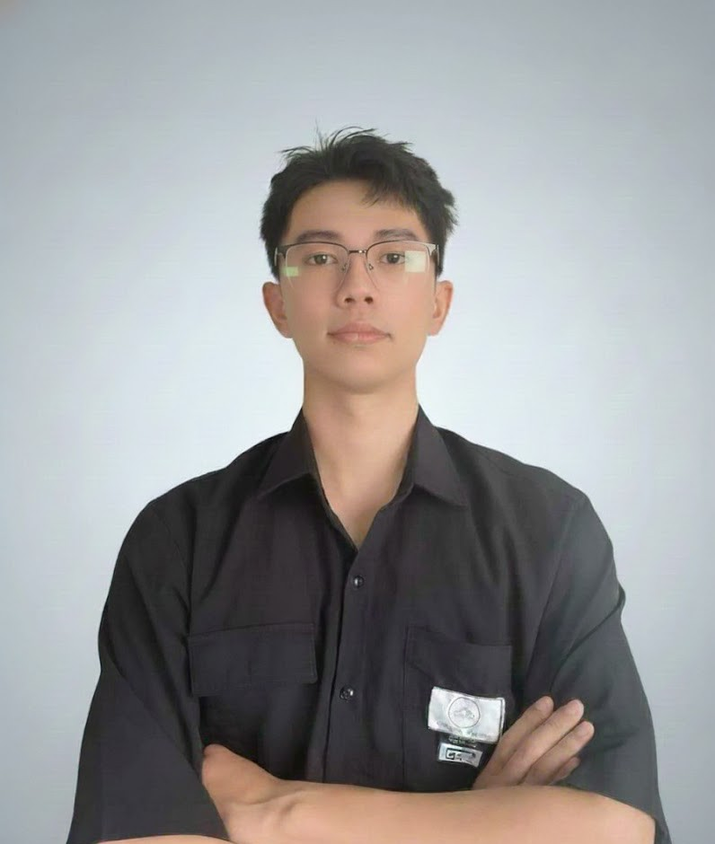

<!--
  MIDNIGHT DIAMOND / EXECUTIVE AI
  Edit data/profile-visuals.json and data/tech-stack.json, then run:
  py scripts/generate_readme_visuals.py
-->

  

   

  

  

    <a href="https://xuantrung-ai-portfolio.vercel.app/"><strong>PORTFOLIO ↗</strong></a>
    &nbsp;&nbsp;·&nbsp;&nbsp;
    <a href="mailto:nxt276651@gmail.com"><strong>EMAIL</strong></a>
    &nbsp;&nbsp;·&nbsp;&nbsp;
    <a href="./assets/NguyenXuanTrungCV.pdf"><strong>RESUME ↗</strong></a>
  

 

## 01 / About

### Applied AI Engineer focused on systems, not demos.

I work at the intersection of **model engineering and backend delivery**—turning research and experiments into evaluated APIs, deployable services, and AI applications built for real-world use.

My focus spans **Computer Vision, LLM & Agentic Systems, and Backend AI**. The operating principle is simple: measure what matters, design the full lifecycle, and connect model quality to product impact.

 

## 02 / Engineering Stack

## 03 / Selected Systems

## 04 / Research & Recognition

## 05 / Credentials

 

  

