<!--
  CHROME / RUBY — GITHUB PROFILE
  Visuals: python scripts/generate_readme_visuals.py
  Verify:  python scripts/generate_readme_visuals.py --check
  Maintenance: docs/MAINTENANCE.md
  Keep image alt text in sync with the visuals.
-->

    <picture>
      <source media="(max-width: 800px) and (prefers-color-scheme: dark) and (prefers-reduced-motion: reduce)" srcset="./assets/chrome-ruby/hero-dark-mobile-still.svg">
      <source media="(max-width: 800px) and (prefers-reduced-motion: reduce)" srcset="./assets/chrome-ruby/hero-light-mobile-still.svg">
      <source media="(prefers-color-scheme: dark) and (prefers-reduced-motion: reduce)" srcset="./assets/chrome-ruby/hero-dark-desktop-still.svg">
      <source media="(prefers-reduced-motion: reduce)" srcset="./assets/chrome-ruby/hero-light-desktop-still.svg">
      <source media="(max-width: 800px) and (prefers-color-scheme: dark)" srcset="./assets/chrome-ruby/hero-dark-mobile.svg">
      <source media="(max-width: 800px)" srcset="./assets/chrome-ruby/hero-light-mobile.svg">
      <source media="(prefers-color-scheme: dark)" srcset="./assets/chrome-ruby/hero-dark-desktop.svg">
      
    </picture>

  <a href="https://xuantrung-ai-portfolio.vercel.app/">
    <picture>
      <source media="(prefers-color-scheme: dark)" srcset="./assets/chrome-ruby/nav-portfolio-dark.svg">
      
    </picture>
  </a>
  <a href="https://xuantrung-ai-portfolio.vercel.app/cv/NguyenXuanTrung_AI_Engineer_CV.pdf">
    <picture>
      <source media="(prefers-color-scheme: dark)" srcset="./assets/chrome-ruby/nav-resume-dark.svg">
      
    </picture>
  </a>
  <a href="https://www.linkedin.com/in/trung-nguyen-3932b4265/">
    <picture>
      <source media="(prefers-color-scheme: dark)" srcset="./assets/chrome-ruby/nav-linkedin-dark.svg">
      
    </picture>
  </a>
  <a href="mailto:nxt276651@gmail.com">
    <picture>
      <source media="(prefers-color-scheme: dark)" srcset="./assets/chrome-ruby/nav-email-dark.svg">
      
    </picture>
  </a>

    <picture>
      <source media="(max-width: 800px) and (prefers-color-scheme: dark)" srcset="./assets/chrome-ruby/work-dark-mobile.svg">
      <source media="(max-width: 800px)" srcset="./assets/chrome-ruby/work-light-mobile.svg">
      <source media="(prefers-color-scheme: dark)" srcset="./assets/chrome-ruby/work-dark-desktop.svg">
      
    </picture>

  <a href="https://github.com/xuantrung-DA/TraceVision">
    <picture>
      <source media="(max-width: 800px) and (prefers-color-scheme: dark) and (prefers-reduced-motion: reduce)" srcset="./assets/chrome-ruby/tracevision-dark-mobile-still.svg">
      <source media="(max-width: 800px) and (prefers-reduced-motion: reduce)" srcset="./assets/chrome-ruby/tracevision-light-mobile-still.svg">
      <source media="(prefers-color-scheme: dark) and (prefers-reduced-motion: reduce)" srcset="./assets/chrome-ruby/tracevision-dark-desktop-still.svg">
      <source media="(prefers-reduced-motion: reduce)" srcset="./assets/chrome-ruby/tracevision-light-desktop-still.svg">
      <source media="(max-width: 800px) and (prefers-color-scheme: dark)" srcset="./assets/chrome-ruby/tracevision-dark-mobile.svg">
      <source media="(max-width: 800px)" srcset="./assets/chrome-ruby/tracevision-light-mobile.svg">
      <source media="(prefers-color-scheme: dark)" srcset="./assets/chrome-ruby/tracevision-dark-desktop.svg">
      
    </picture>
  </a>

  <a href="https://github.com/xuantrung-DA/Subject-Knowledge-Hub">
    <picture>
      <source media="(max-width: 800px) and (prefers-color-scheme: dark) and (prefers-reduced-motion: reduce)" srcset="./assets/chrome-ruby/knowledge-dark-mobile-still.svg">
      <source media="(max-width: 800px) and (prefers-reduced-motion: reduce)" srcset="./assets/chrome-ruby/knowledge-light-mobile-still.svg">
      <source media="(prefers-color-scheme: dark) and (prefers-reduced-motion: reduce)" srcset="./assets/chrome-ruby/knowledge-dark-desktop-still.svg">
      <source media="(prefers-reduced-motion: reduce)" srcset="./assets/chrome-ruby/knowledge-light-desktop-still.svg">
      <source media="(max-width: 800px) and (prefers-color-scheme: dark)" srcset="./assets/chrome-ruby/knowledge-dark-mobile.svg">
      <source media="(max-width: 800px)" srcset="./assets/chrome-ruby/knowledge-light-mobile.svg">
      <source media="(prefers-color-scheme: dark)" srcset="./assets/chrome-ruby/knowledge-dark-desktop.svg">
      
    </picture>
  </a>

  <a href="https://github.com/xuantrung-DA/Paper-2026">
    <picture>
      <source media="(max-width: 800px) and (prefers-color-scheme: dark) and (prefers-reduced-motion: reduce)" srcset="./assets/chrome-ruby/aqb-dark-mobile-still.svg">
      <source media="(max-width: 800px) and (prefers-reduced-motion: reduce)" srcset="./assets/chrome-ruby/aqb-light-mobile-still.svg">
      <source media="(prefers-color-scheme: dark) and (prefers-reduced-motion: reduce)" srcset="./assets/chrome-ruby/aqb-dark-desktop-still.svg">
      <source media="(prefers-reduced-motion: reduce)" srcset="./assets/chrome-ruby/aqb-light-desktop-still.svg">
      <source media="(max-width: 800px) and (prefers-color-scheme: dark)" srcset="./assets/chrome-ruby/aqb-dark-mobile.svg">
      <source media="(max-width: 800px)" srcset="./assets/chrome-ruby/aqb-light-mobile.svg">
      <source media="(prefers-color-scheme: dark)" srcset="./assets/chrome-ruby/aqb-dark-desktop.svg">
      
    </picture>
  </a>

  <a href="https://github.com/xuantrung-DA/Decision-Aware-Trajectory-Utility-in-Offline-RL">
    <picture>
      <source media="(max-width: 800px) and (prefers-color-scheme: dark) and (prefers-reduced-motion: reduce)" srcset="./assets/chrome-ruby/datu-dark-mobile-still.svg">
      <source media="(max-width: 800px) and (prefers-reduced-motion: reduce)" srcset="./assets/chrome-ruby/datu-light-mobile-still.svg">
      <source media="(prefers-color-scheme: dark) and (prefers-reduced-motion: reduce)" srcset="./assets/chrome-ruby/datu-dark-desktop-still.svg">
      <source media="(prefers-reduced-motion: reduce)" srcset="./assets/chrome-ruby/datu-light-desktop-still.svg">
      <source media="(max-width: 800px) and (prefers-color-scheme: dark)" srcset="./assets/chrome-ruby/datu-dark-mobile.svg">
      <source media="(max-width: 800px)" srcset="./assets/chrome-ruby/datu-light-mobile.svg">
      <source media="(prefers-color-scheme: dark)" srcset="./assets/chrome-ruby/datu-dark-desktop.svg">
      
    </picture>
  </a>

  <a href="https://xuantrung-ai-portfolio.vercel.app/#experience">
    <picture>
      <source media="(max-width: 800px) and (prefers-color-scheme: dark) and (prefers-reduced-motion: reduce)" srcset="./assets/chrome-ruby/experience-dark-mobile-still.svg">
      <source media="(max-width: 800px) and (prefers-reduced-motion: reduce)" srcset="./assets/chrome-ruby/experience-light-mobile-still.svg">
      <source media="(prefers-color-scheme: dark) and (prefers-reduced-motion: reduce)" srcset="./assets/chrome-ruby/experience-dark-desktop-still.svg">
      <source media="(prefers-reduced-motion: reduce)" srcset="./assets/chrome-ruby/experience-light-desktop-still.svg">
      <source media="(max-width: 800px) and (prefers-color-scheme: dark)" srcset="./assets/chrome-ruby/experience-dark-mobile.svg">
      <source media="(max-width: 800px)" srcset="./assets/chrome-ruby/experience-light-mobile.svg">
      <source media="(prefers-color-scheme: dark)" srcset="./assets/chrome-ruby/experience-dark-desktop.svg">
      
    </picture>
  </a>

  <a href="https://xuantrung-ai-portfolio.vercel.app/#research">
    <picture>
      <source media="(max-width: 800px) and (prefers-color-scheme: dark) and (prefers-reduced-motion: reduce)" srcset="./assets/chrome-ruby/research-dark-mobile-still.svg">
      <source media="(max-width: 800px) and (prefers-reduced-motion: reduce)" srcset="./assets/chrome-ruby/research-light-mobile-still.svg">
      <source media="(prefers-color-scheme: dark) and (prefers-reduced-motion: reduce)" srcset="./assets/chrome-ruby/research-dark-desktop-still.svg">
      <source media="(prefers-reduced-motion: reduce)" srcset="./assets/chrome-ruby/research-light-desktop-still.svg">
      <source media="(max-width: 800px) and (prefers-color-scheme: dark)" srcset="./assets/chrome-ruby/research-dark-mobile.svg">
      <source media="(max-width: 800px)" srcset="./assets/chrome-ruby/research-light-mobile.svg">
      <source media="(prefers-color-scheme: dark)" srcset="./assets/chrome-ruby/research-dark-desktop.svg">
      
    </picture>
  </a>

  <a href="https://xuantrung-ai-portfolio.vercel.app/#capabilities">
    <picture>
      <source media="(max-width: 800px) and (prefers-color-scheme: dark) and (prefers-reduced-motion: reduce)" srcset="./assets/chrome-ruby/toolkit-dark-mobile-still.svg">
      <source media="(max-width: 800px) and (prefers-reduced-motion: reduce)" srcset="./assets/chrome-ruby/toolkit-light-mobile-still.svg">
      <source media="(prefers-color-scheme: dark) and (prefers-reduced-motion: reduce)" srcset="./assets/chrome-ruby/toolkit-dark-desktop-still.svg">
      <source media="(prefers-reduced-motion: reduce)" srcset="./assets/chrome-ruby/toolkit-light-desktop-still.svg">
      <source media="(max-width: 800px) and (prefers-color-scheme: dark)" srcset="./assets/chrome-ruby/toolkit-dark-mobile.svg">
      <source media="(max-width: 800px)" srcset="./assets/chrome-ruby/toolkit-light-mobile.svg">
      <source media="(prefers-color-scheme: dark)" srcset="./assets/chrome-ruby/toolkit-dark-desktop.svg">
      
    </picture>
  </a>

  <a href="mailto:nxt276651@gmail.com">
    <picture>
      <source media="(max-width: 800px) and (prefers-color-scheme: dark) and (prefers-reduced-motion: reduce)" srcset="./assets/chrome-ruby/footer-dark-mobile-still.svg">
      <source media="(max-width: 800px) and (prefers-reduced-motion: reduce)" srcset="./assets/chrome-ruby/footer-light-mobile-still.svg">
      <source media="(prefers-color-scheme: dark) and (prefers-reduced-motion: reduce)" srcset="./assets/chrome-ruby/footer-dark-desktop-still.svg">
      <source media="(prefers-reduced-motion: reduce)" srcset="./assets/chrome-ruby/footer-light-desktop-still.svg">
      <source media="(max-width: 800px) and (prefers-color-scheme: dark)" srcset="./assets/chrome-ruby/footer-dark-mobile.svg">
      <source media="(max-width: 800px)" srcset="./assets/chrome-ruby/footer-light-mobile.svg">
      <source media="(prefers-color-scheme: dark)" srcset="./assets/chrome-ruby/footer-dark-desktop.svg">
      
    </picture>
  </a>

