```mermaid
%%{init: {"theme": "dark", "themeVariables": {"primaryColor": "#0D1117", "primaryTextColor": "#E6EDF3", "primaryBorderColor": "#F5C542", "lineColor": "#00E5FF", "secondaryColor": "#111827", "tertiaryColor": "#14213D"}} }%%
flowchart LR
    A[Raw Data] --> B[Feature Engineering]
    B --> C[ML / LLM Core]
    C --> D[FastAPI Service]
    D --> E[Docker Container]
    E --> F[AWS EC2 Deployment]
    F --> G[Real User Value]
```

<!--
  Premium AI-Tech GitHub Profile README
  Palette: Obsidian #0D1117 | Cyber Cyan #00E5FF | Royal Gold #F5C542 | Aurora Purple #7C3AED
  Tip: upload your CV PDF to ./assets/Nguyen_Xuan_Trung_AI_Engineer_CV.pdf or change the Resume badge link below.
-->

<div align="center">
  
</div>

<p align="center">
  <a href="https://git.io/typing-svg">
    
  </a>
</p>

<p align="center">
  <a href="https://github.com/xuantrung-DA">
    
  </a>
  <a href="mailto:nxt276651@gmail.com">
    
  </a>
  <a href="./assets/Nguyen_Xuan_Trung_AI_Engineer_CV.pdf">
    
  </a>
</p>

<p align="center">
  
  
  
  
</p>

<br />

<table>
  <tr>
    <td width="58%" valign="top">

## ⚜️ About Me

Hi, I'm **Nguyen Xuan Trung**, an **Artificial Intelligence undergraduate at FPT University** focused on building practical AI systems from research experiments to deployable products.

I work across **Computer Vision**, **LLM-powered workflows**, **backend AI services**, and **MLOps-style deployment**. My current direction is simple: **turn intelligent models into reliable products that people can actually use**.

- 🎓 **B.Sc. Artificial Intelligence**, FPT University — GPA **3.75/4.0**
- 🧠 Interested in **AI Engineer / Applied AI Intern** roles
- 🔭 Building **Flux AI**, an AI personal financial coach powered by multi-step LLM orchestration
- 🛡️ Built a secure login pipeline with **Face Anti-Spoofing + Face Recognition**
- 🛰️ Experienced with **FastAPI**, **Docker**, **PostgreSQL**, and **AWS EC2**

</td>
<td width="42%" valign="top">

<p align="center">
  
</p>

### 🧬 AI Signature

```yaml
name: Nguyen Xuan Trung
role: AI Engineer
location: Ho Chi Minh City, Vietnam
university: FPT University
core_stack:
  - PyTorch
  - FastAPI
  - Docker
  - PostgreSQL
  - AWS EC2
focus:
  - Computer Vision
  - LLM Applications
  - Agentic AI Workflows
  - Backend AI Systems
```

</td>
</tr>
</table>

---

## 🚀 AI-Tech Universe

<div align="center">
  
</div>

<br />

<p align="center">
  
  
  
  
  
  
  
  
  
  
</p>

---

## 🧠 What I Build

<table>
  <tr>
    <td align="center" width="25%">
      <h3>👁️ Computer Vision</h3>
      <p>Face Anti-Spoofing, Face Recognition, object detection, OpenCV pipelines, model optimization.</p>
    </td>
    <td align="center" width="25%">
      <h3>🤖 LLM Workflows</h3>
      <p>Market intelligence, AI assistants, multi-step orchestration, structured reports, business insights.</p>
    </td>
    <td align="center" width="25%">
      <h3>⚙️ Backend AI</h3>
      <p>FastAPI services, REST APIs, PostgreSQL, data pipelines, Postman validation, production thinking.</p>
    </td>
    <td align="center" width="25%">
      <h3>☁️ MLOps Mindset</h3>
      <p>Dockerized services, AWS EC2 deployment, reproducible workflows, model-to-product delivery.</p>
    </td>
  </tr>
</table>



---

## 🛰️ Featured AI Missions

<table>
  <tr>
    <td width="50%" valign="top">
      <h3>💸 Flux AI — AI Personal Financial Coach</h3>
      <p>
        
        
      </p>
      <p>Developing a multi-step AI advisory workflow for personalized financial recommendations.</p>
      <ul>
        <li>LLM orchestration with FastAPI</li>
        <li>Specialized agents for transaction analysis and market signal retrieval</li>
        <li>Transaction-triggered product recommendation for Gen Z users</li>
      </ul>
      <p><b>Stack:</b> FastAPI · LLM Applications · Agentic Workflows · Backend AI</p>
    </td>
    <td width="50%" valign="top">
      <h3>🛡️ Secure Login System</h3>
      <p>
        
        
        
      </p>
      <p>Built an end-to-end authentication pipeline combining Face Anti-Spoofing and Face Recognition.</p>
      <ul>
        <li>Optimized CDCN-based Face Anti-Spoofing through experimentation and tuning</li>
        <li>Integrated Face Recognition system with 95.8% accuracy</li>
        <li>Designed for secure authentication requirements</li>
      </ul>
      <p><b>Stack:</b> PyTorch · OpenCV · Face Recognition · Computer Vision</p>
    </td>
  </tr>
  <tr>
    <td width="50%" valign="top">
      <h3>🛒 AI FOR ECOM — ECE Technology</h3>
      <p>
        
        
      </p>
      <p>Built AI modules and internal workflows for e-commerce analytics and intelligence.</p>
      <ul>
        <li>Product performance segmentation using MiniBatch K-Means with RFM features</li>
        <li>Dual labeling logic for 30-day performance and velocity-based movement analysis</li>
        <li>LLM-powered market intelligence using SerpAPI and Gemini API</li>
        <li>ETL pipelines from SQL Server to PostgreSQL</li>
      </ul>
      <p><b>Stack:</b> Python · FastAPI · Docker · PostgreSQL · AWS EC2 · Gemini API</p>
    </td>
    <td width="50%" valign="top">
      <h3>🎙️ AI Livestream Support Platform</h3>
      <p>
        
        
      </p>
      <p>Developed AI-powered livestream support for sales and post-event analysis.</p>
      <ul>
        <li>Script generation from historical sales data</li>
        <li>Live customer response assistance</li>
        <li>Post-livestream analysis and business-support insights</li>
      </ul>
      <p><b>Stack:</b> LLM Integration · AI Pipeline Design · Business AI</p>
    </td>
  </tr>
</table>

---

## 🏆 Research, Honors & Signals

<table>
  <tr>
    <td width="33%" valign="top">
      <h3>🥇 Top 100 Excellent Students</h3>
      <p><b>Summer & Fall Semesters, 2025</b></p>
      <p>Academic excellence recognition at FPT University.</p>
    </td>
    <td width="33%" valign="top">
      <h3>📘 Springer LNAI</h3>
      <p><b>Accepted Paper · Scopus Q2</b></p>
      <p>Weather forecasting system and shelter suggestion for Sydney, Melbourne, and Canberra.</p>
    </td>
    <td width="33%" valign="top">
      <h3>📙 Springer LNEE</h3>
      <p><b>Accepted Paper · Scopus Q4</b></p>
      <p>Optimizing YOLOv11n for real-time object detection with quantization and model optimization.</p>
    </td>
  </tr>
</table>

---

## 📜 Certifications

<table>
  <tr>
    <td><b>Natural Language Processing</b></td>
    <td>DeepLearning.AI</td>
    <td>04/2026</td>
  </tr>
  <tr>
    <td><b>Neural Networks and Deep Learning</b></td>
    <td>DeepLearning.AI</td>
    <td>11/2025</td>
  </tr>
  <tr>
    <td><b>Introduction to Containers with Docker, Kubernetes & OpenShift</b></td>
    <td>IBM</td>
    <td>10/2025</td>
  </tr>
  <tr>
    <td><b>Developing AI Applications with Python and Flask</b></td>
    <td>Course Certificate</td>
    <td>09/2025</td>
  </tr>
</table>

---

## 📊 GitHub Intelligence Dashboard

<p align="center">
  
  
</p>

<p align="center">
  
</p>

<p align="center">
  
</p>

---

## 🧭 Current Navigation

<table>
  <tr>
    <td width="50%" valign="top">
      <h3>🔭 Currently Building</h3>
      <ul>
        <li><b>Flux AI</b> — AI personal financial coach</li>
        <li>Agentic workflows for transaction analysis and recommendation</li>
        <li>Backend AI services with FastAPI and production-ready APIs</li>
      </ul>
    </td>
    <td width="50%" valign="top">
      <h3>📚 Currently Improving</h3>
      <ul>
        <li>LLM application design and evaluation</li>
        <li>Computer Vision model optimization</li>
        <li>Dockerized deployment and cloud infrastructure</li>
      </ul>
    </td>
  </tr>
</table>

---

## 🤝 Connect With Me

<p align="center">
  <a href="https://github.com/xuantrung-DA">
    
  </a>
  <a href="mailto:nxt276651@gmail.com">
    
  </a>
</p>

<p align="center">
  <b>“I build AI with a product mindset: accurate, useful, deployable.”</b>
</p>

<div align="center">
  
</div>
